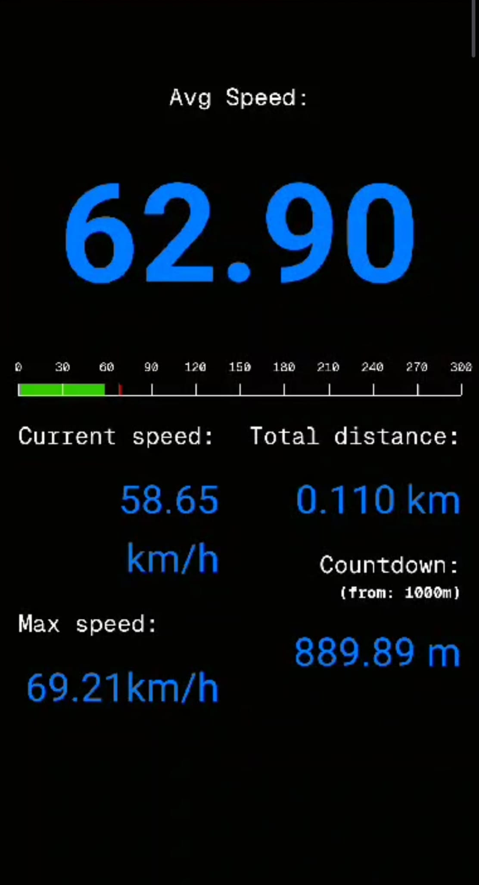

# 🏁 SpeedSync

**SpeedSync** is a race tracking app that uses GPS to measure **speed, distance, and average speed** in real-time. It also features a countdown from **1000m to 0m**, helping racers stay aware of their remaining distance.

## 🚀 Features

- 📍 **Real-time GPS Tracking** – Measures your **speed and distance** while racing.
- 📊 **Average Speed Calculation** – Keeps track of your overall performance.
- ⏳ **1000m Countdown** – Displays the remaining distance dynamically.
- 🔄 **Live Updates** – Continuously updates speed and distance as you move.

## 📸 Screenshots

## 🏎️ How It Works
Open the app and grant GPS permissions.
Start moving, and the app will begin tracking speed & distance.
Watch your average speed update in real-time.
The countdown starts from 1000m and decreases as you move forward.

## 🤝 Contributing
Feel free to contribute by submitting issues or creating pull requests! 🚀

## 📄 License
This project is open-source under the MIT License.